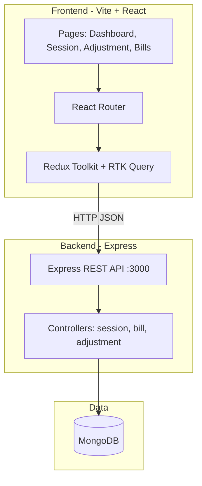
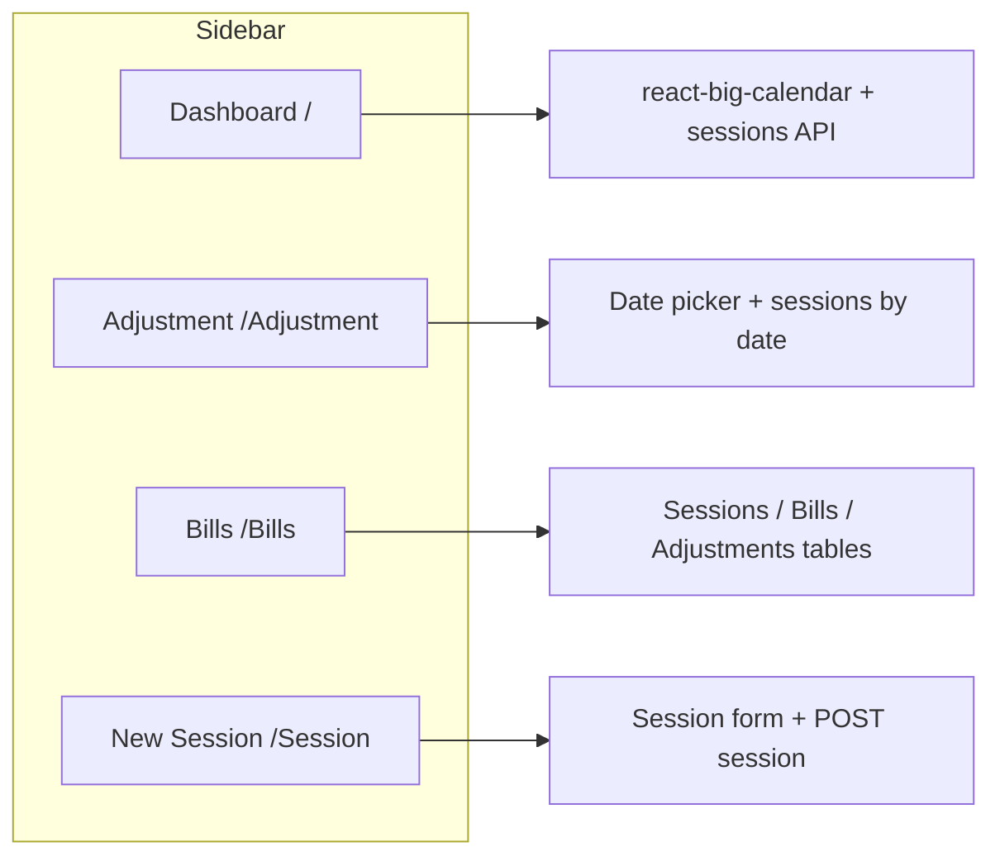
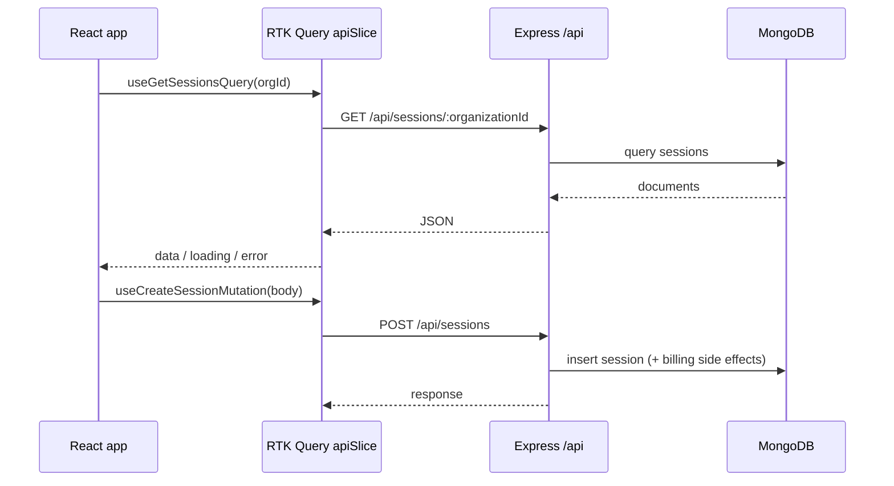

# Tutor Scheduler (Calendar)

A full-stack **tutoring session scheduler** with a calendar dashboard, session creation, billing views, and reschedule workflows. The UI is branded as **Tutor Scheduler** and talks to a **Node.js + Express + MongoDB** API.

---

## What this project does

| Area | Description |
|------|-------------|
| **Dashboard** (`/`) | Month / week / day calendar (**react-big-calendar**) showing sessions from the API. Events are color-coded by billing status (billed vs unbilled). |
| **New Session** (`/Session`) | Form to create sessions: tutor, student, subject, cost, recurrence, date (**shadcn Calendar** + time inputs), billing status. Submits via **RTK Query** `createSession`. |
| **Adjustment** (`/Adjustment`) | Pick a date, list sessions for that day, reschedule flows (**Reschedule** component). |
| **Bills** (`/Bills`) | Tabs for **sessions**, **bills**, and **adjustments** with tables (**TanStack Table**-style UI). |

The shell layout uses a **collapsible sidebar** (Dashboard, Adjustment, Bills, New Session) and **React Router** for navigation.

---

## Architecture (visual)



---

## Routes and screens



---

## Data flow (API client)



---

## Tech stack

| Layer | Technologies |
|-------|----------------|
| **Frontend** | React 19, TypeScript, Vite 8, Tailwind CSS 4, shadcn/ui (Radix), react-big-calendar, react-day-picker, date-fns, React Router 7, Redux Toolkit + RTK Query |
| **Backend** | Node.js, Express 5, Mongoose, CORS, dotenv |
| **Data** | MongoDB |

---

## Repository layout

```
calender/
├── frontend/                 # Vite React app
│   ├── src/
│   │   ├── App.tsx           # Route definitions
│   │   ├── main.tsx          # Redux Provider + BrowserRouter
│   │   ├── Dashboard.tsx     # Home → Demo calendar
│   │   ├── Demo.tsx          # Main calendar + useGetSessionsQuery
│   │   ├── store/            # Redux store + RTK Query api slice
│   │   └── ui/               # Dashboard shell, session, bills, adjustments
│   └── package.json
├── backend/
│   ├── server.js             # Express app + route wiring
│   ├── controller/           # session, bill, adjustment
│   ├── model/                # Mongoose models
│   └── config/mongoose.js
└── README.md
```

---

## REST API (backend)

Base URL used by the frontend: `http://localhost:3000/api` (see `frontend/src/store/api.tsx`).

| Method | Path | Purpose |
|--------|------|---------|
| `POST` | `/api/sessions` | Create session (and related billing logic) |
| `GET` | `/api/sessions/:organizationId` | List sessions for an organization |
| `GET` | `/api/sessions/:organizationId/:date` | Sessions on a given date |
| `PUT` | `/api/sessions/reschedule` | Reschedule a session |
| `GET` | `/api/bills/:organizationId` | Bills |
| `GET` | `/api/adjustments/:organizationId` | Adjustments |

---

## Prerequisites

- **Node.js** (LTS recommended)
- **MongoDB** reachable from the backend (connection string in backend `.env` — see `backend/config/mongoose.js`)

---

## Run locally

### 1. Backend

```bash
cd backend
npm install
# Configure .env for MongoDB, then:
npm start
```

Server listens on **port 3000** by default (`http://localhost:3000`).

### 2. Frontend

```bash
cd frontend
npm install
npm run dev
```

Open the URL Vite prints (typically `http://localhost:5173`). Ensure the backend is running so calendar and tables can load data.

### 3. Build (frontend)

```bash
cd frontend
npm run build
npm run preview   # optional: test production build
```

---

## Configuration notes

- **Organization ID**: Several hooks use a fixed organization id string for development (`frontend` demo data). Replace with auth, env, or route params for production.
- **CORS**: Enabled on the Express app for browser access from the dev server origin.

---

## Scripts (frontend)

| Command | Description |
|---------|-------------|
| `npm run dev` | Start Vite dev server with HMR |
| `npm run build` | Typecheck + production bundle |
| `npm run preview` | Serve built app locally |
| `npm run lint` | ESLint |

---

## License

No license file is present in this repository; add one if you distribute the project.
